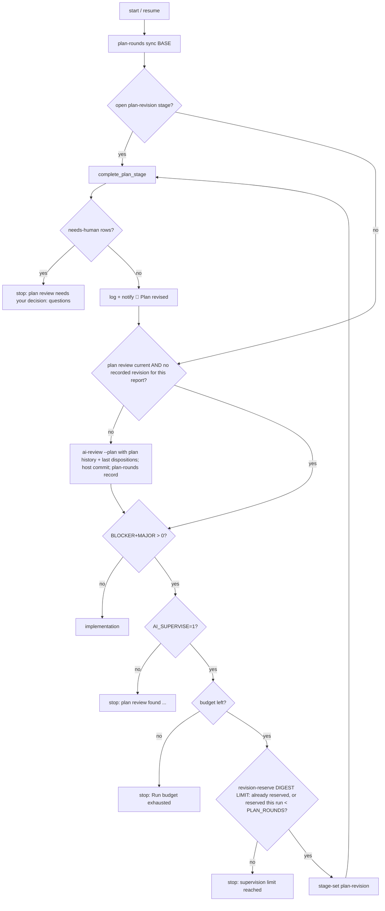

# Plan: FL-04 bounded supervisor

Branch `feature/supervisor` from `master` (ba330ef), worktree `~/Projects/wt/agents-supervisor`.
Revision 3 (answers plan review round 2, HEAD dfc03c8; revision 2 answered round 1, HEAD
cc8c464; dispositions in `.ai/reviews/dispositions.md` → "Plan review round 1" and "Plan review
round 2").

## Coordination
`fix/catchup-review` (catch-up M1/M2: reviewer allowlist in `ai-review`/`workflow.py`, stopped-
attempt outcomes in `ai-run`) is planned but not merged. This branch implements only after it
merges: mission control rebuilds the branch on master (the plan files carry over) and the plan
is reviewed again against the merged baseline before T001 starts.

## Architecture (host state, all outside the checkout; `binding_dir()` = state root/reviews/<key>)
| Record | Where | Written by | Used for |
| --- | --- | --- | --- |
| Settings `AI_SUPERVISE*` | run manifest `env` (`RUN_SETTINGS`) | `run-manifest start` | restored by `ai-recover` (T001) |
| Run budget `{total, used, open}` (total from `AI_RUN_BUDGET` at a human start; the setting itself is not in `RUN_SETTINGS`) | run manifest `budget` | `run-budget open/close` from `ai-run --host-budget` | all `ai-run` calls of a pipeline run; gate for supervised steps (T002) |
| Plan-review rounds `[{commit, report_digest, plan_digest, blockers, majors, minors}]` | `plan-rounds-<branch>.json` | `plan-rounds record BASE COMMIT` / `plan-rounds sync BASE` after the host commit of each plan review (idempotent per report digest) | round number n, history; counted only in `BASE..HEAD` (T003) |
| Plan revisions `[{commit, report_digest, round}]` | `plan-revisions-<branch>.json` | `ai-run --revise-plan` after its counted commit | "revision done for this report" → re-review due; refuses a second revision (T005) |
| Revisions reserved this run `[report_digest]` | run manifest `plan_revisions` | `run-manifest revision-reserve DIGEST LIMIT` BEFORE `stage-set` and again (idempotent) on every stage completion | per-run limit, counted once (T006) |
| Stage `plan-revision start_head report_digest` | `stage-<branch>.json` (existing) | `stage-set plan-revision` | crash completion (T006) |
| Fix rounds `[{commit, review_head, review_digest, blockers, majors}]` (legacy: bare hashes) | `fix-rounds-<branch>.json` (existing) | `fix-rounds record` in `ai-run --triage` | count (as today) + trend (T009) |
| Extra fix round reserved `review_digest` | run manifest `extra_fix_round` | before the extra triage stage | once per run (T009) |

Round numbering: plan-review round n = position of the current `.ai/reviews/plan.md` (its report
digest must be the last record) among this branch's plan-round records whose commit is in
`BASE..HEAD` (BASE: the pipeline's `base_sha`; by hand `ai-review --plan`/`ai-run --revise-plan`
use `merge-base` of `--base REF`, default `main` like `ai-pipeline`), so a re-created branch name
never inherits merged rounds. A branch with plan-review commits but no records is initialised once
from host-subject commits in `BASE..HEAD` that changed `plan.md` (like `fix-rounds init`; can only
raise n, i.e. add the Convergence requirement or a stronger model). Revision n answers round n.
`plan-rounds sync BASE` records the newest host-subject commit in `BASE..HEAD` whose committed
`plan.md` is the current verified report when that report has no record yet (the crash window
between the review's host commit and its record); records are idempotent per report digest, so a
second commit holding the same report never adds a round.

Revision model: one pipeline function `plan_revision_model` computes it from `plan-rounds current
BASE` (round n) and the manifest-restored settings (`opus`, or `AI_SUPERVISE_ESCALATE_MODEL` when
n ≥ `AI_SUPERVISE_ESCALATE_ROUND`); `complete_plan_stage` always calls it, so a fresh start and a
resume of the same revision use the same model.

## Run budget details (T002)
`AI_RUN_BUDGET` (seconds, `^[1-9][0-9]{0,6}$`, default 57600) is read by `ai_config` from the
user config or environment, validated by `ai-pipeline` at a human start before any agent, and
captured only as the manifest budget total; a resume never reads it (the total is already in the
manifest), so it is deliberately not in `RUN_SETTINGS`/`ai-recover`'s lists. A remaining budget
below `BUDGET_FLOOR` (60 s) counts as exhausted everywhere (`run-budget open` fails,
`run-budget remaining` prints 0), so no Claude session starts on a sliver. Under `--host-budget`,
`ai-run` dies with `Run budget exhausted (used U of T s)` when the budget (not the per-call
`--run-timeout` cap) is what ran out; that reason is always-escalate in `ai-recover`, so no
recovery session is spent. The per-call cap keeps today's recoverable "Run time limit reached".

## Plan-dispositions section contract (T004)
Host writes (idempotent, appended) before the session:

    ## Plan review round <n> (report <64-hex report digest>)

    Plan review HEAD: <40-hex>

    | Finding | Disposition | Evidence / reason | Task |
    | --- | --- | --- | --- |

`plan-dispositions-check` validates ONLY that section (heading unique, last section, and the text
above it byte-identical to: START's text above the same header when START's file has that header
(resume after the session committed its rows); else START's whole file; else, when the file did
not exist at START, the exact host preamble (title + contract comment)): exactly one row per BLOCKER/MAJOR ID of
the verified current plan review, no rows for unknown IDs, no duplicates (MINOR rows optional);
`accepted` → ≥1 `T###` that exists and is TODO; `rejected` → evidence ≥ 15 chars; `needs-human` →
a question ≥ 15 chars; from round 3 a same-line `Convergence: <text>` inside the section; the task
queue passes `tasks check`, every pre-existing task keeps its status and every new task is TODO
(no invented DONE work; the "no task DONE" plan gate stays). Prints
`accepted=a rejected=r needs_human=h`. `--questions` prints at most 3 needs-human questions, each
whitespace-collapsed to one line and capped at 300 chars (like `recover_decision`), plus
`(+k more in .ai/reviews/plan-dispositions.md)`; only this bounded text reaches
`.ai/local/last-error` and notifications.

## Pipeline plan-review loop (T007)

`complete_plan_stage` (fresh start and resume alike): `stage-verify`; `committed` → `stage-clear`;
`pending` → `revision-reserve DIGEST LIMIT` again (idempotent; a stage opened by a crash-
interrupted start is counted here), `plan_revision_model`, `ai-run --approved --revise-plan --since
START --base BASE --model M --host-budget`, `stage-verify` must say `committed`, `stage-clear`.
Reserve-before-stage means a crash between the two leaves a reservation without a stage; the
resume finds the digest already reserved (no second count, no limit stop) and opens the stage.

`H1`–`H4` and "Plan revision stage" failures are terminal: `ai-recover` escalates them without a
Claude session (T006). Plan reviews after a revision get `PLAN REVISION CONTEXT` (round n, the
previous section's location, rendered plan history); never implementation-review history.

## Format retry (T010)
`review-format-check plan|code REPORT` = exactly the content checks `publish-plan-review` /
`publish-review` run (shared function, no writes). `ai-review` runs it after `run_review`; on
failure (and `AI_SUPERVISE` on, budget left under the pipeline) it notifies, keeps the first
report in `.ai/local/`, reruns `run_review` once with `FORMAT ERROR: <message>. Return the full
report again in the required structure.`, then publishes (a second format failure dies as today).
After a retried publish it appends a run-log line; the pipeline's `review_record` commits
`.ai/run-log.md` with the review when dirty.

## Task order
T001 settings → T002 run budget → T003 plan-round records/history → T004 section + validator →
T005 `ai-run --revise-plan` → T006 stage + recovery → T007 pipeline loop → T008 crash/resume
scenarios → T009 extra fix round → T010 format retry → T011 docs reconciliation/handoff.
Test fixture: T001 sets `AI_SUPERVISE='0'` in `ToolkitTest.setUp` (same pattern as
`AI_AUTO_RECOVER='0'`), so existing plan-stop, malformed-review and counts-lie tests keep today's
behaviour unchanged; supervised tests opt in with `AI_SUPERVISE='1'` per call.
Flow-changing tasks (T002, T006, T007, T009, T010) update vault `agents-flow.md` (+ `updated:`)
and set the handoff `## Flow chart` line to "Flow chart updated" themselves; this needs the
pipeline started with `--knowledge-dir "$HOME/zWiki/zWiki/20 Projects/agents"`. Without vault
access a task records the limitation in its result and adds the chart change to the handoff
"Needs you" list instead of claiming it.

## Revision session boundary
`ai-run --revise-plan` passes `--tools Read,Glob,Grep,Edit,Bash` (no `Write`) and the
`plan-revision-allowlist`; the host scope check after the session and the byte-identical
`plan.md`/`current.md` checks are the defense in depth.

## Risks
- Budget semantics change for long pipelines with fix rounds (now one shared allowance):
  documented; Zack may raise `--run-timeout`.
- `fix-rounds` record format change: legacy bare hashes must keep counting and closing triage
  stages (`stage_verify`), they just carry no counts (insufficient history → no extra round).
- New prompt `plan-revision.md` reaches this repo's frozen `.ai/prompts` only via a human
  `setup-project --upgrade`; tests install from `templates/`.
