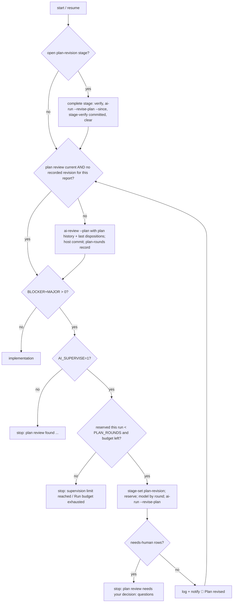

# Plan: FL-04 bounded supervisor

Branch `feature/supervisor` from `master` (ba330ef), worktree `~/Projects/wt/agents-supervisor`.
Revision 2 (answers plan review round 1, HEAD cc8c464; dispositions in
`.ai/reviews/dispositions.md` → "Plan review round 1").

## Coordination
`fix/catchup-review` (catch-up M1/M2: reviewer allowlist in `ai-review`/`workflow.py`, stopped-
attempt outcomes in `ai-run`) is planned but not merged. This branch implements only after it
merges: mission control rebuilds the branch on master (the plan files carry over) and the plan
is reviewed again against the merged baseline before T001 starts.

## Architecture (host state, all outside the checkout; `binding_dir()` = state root/reviews/<key>)
| Record | Where | Written by | Used for |
| --- | --- | --- | --- |
| Settings `AI_SUPERVISE*` | run manifest `env` (`RUN_SETTINGS`) | `run-manifest start` | restored by `ai-recover` (T001) |
| Run budget `{total, used, open}` | run manifest `budget` | `run-budget open/close` from `ai-run --host-budget` | all `ai-run` calls of a pipeline run; gate for supervised steps (T002) |
| Plan-review rounds `[{commit, report_digest, plan_digest, blockers, majors, minors}]` | `plan-rounds-<branch>.json` | `plan-rounds record` after the host commit of each plan review | round number n, history (T003) |
| Plan revisions `[{commit, report_digest, round}]` | `plan-revisions-<branch>.json` | `ai-run --revise-plan` after its counted commit | "revision done for this report" → re-review due (T005) |
| Revisions reserved this run `[report_digest]` | run manifest `plan_revisions` | `run-manifest revision-reserve` before the stage starts | per-run limit, counted once (T006) |
| Stage `plan-revision start_head report_digest` | `stage-<branch>.json` (existing) | `stage-set plan-revision` | crash completion (T006) |
| Fix rounds `[{commit, review_head, review_digest, blockers, majors}]` (legacy: bare hashes) | `fix-rounds-<branch>.json` (existing) | `fix-rounds record` in `ai-run --triage` | count (as today) + trend (T009) |
| Extra fix round reserved `review_digest` | run manifest `extra_fix_round` | before the extra triage stage | once per run (T009) |

Round numbering: plan-review round n = position of the current `.ai/reviews/plan.md` (its report
digest must be the last record) among this branch's plan-round records reachable from HEAD; a
branch with plan-review commits but no records is initialised once from host-subject commits that
changed `plan.md` (like `fix-rounds init`; can only raise n, i.e. add the Convergence requirement
or a stronger model). Revision n answers round n.

## Plan-dispositions section contract (T004)
Host writes (idempotent, appended) before the session:

    ## Plan review round <n> (report <64-hex report digest>)

    Plan review HEAD: <40-hex>

    | Finding | Disposition | Evidence / reason | Task |
    | --- | --- | --- | --- |

`plan-dispositions-check` validates ONLY that section (heading unique, last section, everything
above it byte-identical to the file at the stage start): exactly one row per BLOCKER/MAJOR ID of
the verified current plan review, no rows for unknown IDs, no duplicates (MINOR rows optional);
`accepted` → ≥1 `T###` that exists and is TODO; `rejected` → evidence ≥ 15 chars; `needs-human` →
a question ≥ 15 chars; from round 3 a same-line `Convergence: <text>` inside the section; the task
queue passes `tasks check`, every pre-existing task keeps its status and every new task is TODO
(no invented DONE work; the "no task DONE" plan gate stays). Prints
`accepted=a rejected=r needs_human=h`.

## Pipeline plan-review loop (T007)

`H1`–`H3` and "Plan revision stage" failures are terminal: `ai-recover` escalates them without a
Claude session (T006). Plan reviews after a revision get `PLAN REVISION CONTEXT` (round n, the
previous section's location, rendered plan history); never implementation-review history.

## Format retry (T010)
`review-format-check plan|code REPORT` = exactly the content checks `publish-plan-review` /
`publish-review` run (shared function, no writes). `ai-review` runs it after `run_review`; on
failure (and `AI_SUPERVISE` on, budget left under the pipeline) it notifies, keeps the first
report in `.ai/local/`, reruns `run_review` once with `FORMAT ERROR: <message>. Return the full
report again in the required structure.`, then publishes (a second format failure dies as today).
After a retried publish it appends a run-log line; the pipeline's `review_record` commits
`.ai/run-log.md` with the review when dirty.

## Task order
T001 settings → T002 run budget → T003 plan-round records/history → T004 section + validator →
T005 `ai-run --revise-plan` → T006 stage + recovery → T007 pipeline loop → T008 crash/resume
scenarios → T009 extra fix round → T010 format retry → T011 docs reconciliation/handoff.
Flow-changing tasks (T002, T006, T007, T009, T010) update vault `agents-flow.md` (+ `updated:`)
and set the handoff `## Flow chart` line to "Flow chart updated" themselves; this needs the
pipeline started with `--knowledge-dir "$HOME/zWiki/zWiki/20 Projects/agents"`. Without vault
access a task records the limitation in its result and adds the chart change to the handoff
"Needs you" list instead of claiming it.

## Risks
- Budget semantics change for long pipelines with fix rounds (now one shared allowance):
  documented; Zack may raise `--run-timeout`.
- `fix-rounds` record format change: legacy bare hashes must keep counting and closing triage
  stages (`stage_verify`), they just carry no counts (insufficient history → no extra round).
- New prompt `plan-revision.md` reaches this repo's frozen `.ai/prompts` only via a human
  `setup-project --upgrade`; tests install from `templates/`.
